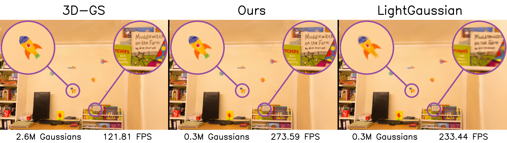

# PUP 3D-GS: Principled Uncertainty Pruning for 3D Gaussian Splatting
Alex Hanson*, Allen Tu*, Vasu Singla, Mayuka Jayawardhana, Matthias Zwicker, Tom Goldstein (* indicates equal contribution)

[arXiv](https://arxiv.org/abs/2406.10219)



This repository is the official code for the paper "PUP 3D-GS: Principled Uncertainty Pruning for 3D Gaussian Splatting". It is built on top of the [3D-GS](https://github.com/graphdeco-inria/gaussian-splatting) and [LightGaussian](https://github.com/VITA-Group/LightGaussian) codebases. Fisher computation in the included submodule is built using code from [FisherRF](https://github.com/JiangWenPL/FisherRF). If you make use of this code in your research, please consider citing these works in addition to ours.


**Abstract:** *Recent advancements in novel view synthesis have enabled real-time rendering speeds and high reconstruction accuracy. 3D Gaussian Splatting (3D-GS), a foundational point-based parametric 3D scene representation, models scenes as large sets of 3D Gaussians. Complex scenes can comprise of millions of Gaussians, amounting to large storage and memory requirements that limit the viability of 3D-GS on devices with limited resources. Current techniques for compressing these pretrained models by pruning Gaussians rely on combining heuristics to determine which ones to remove. In this paper, we propose a principled spatial sensitivity pruning score that outperforms these approaches. It is computed as a second-order approximation of the reconstruction error on the training views with respect to the spatial parameters of each Gaussian. Additionally, we propose a multi-round prune-refine pipeline that can be applied to any pretrained 3D-GS model without changing the training pipeline. After pruning 88.44% of the Gaussians, we observe that our PUP pipeline increases the average rendering speed of 3D-GS by 2.65x while retaining more salient foreground information and achieving higher image quality metrics than previous pruning techniques on scenes from the Mip-NeRF 360, Tanks \& Temples, and Deep Blending datasets.*

## Setup
Follow the setup instruction for the original [3D-GS](https://github.com/graphdeco-inria/gaussian-splatting) codebase, including recursively cloning the repository submodules. 

```shell
conda env create --file environment.yml
conda activate gaussian_splatting_pup
```

We created an additional submodule for CUDA Fisher computation: `rasterization_and_pup_fisher`. Ensure that it is also cloned and installed.

## Running

### Full Pruning Pipeline

To prune and evaluate a scene, set the environment variables `SCENE_DATA_PATH`, `SCENE_MODEL_PATH`, and `SCENE_NAME`, then run:

```shell
bash scripts/full_pruning_pipeline.sh
```

* `SCENE_DATA_PATH` is the path to the COLMAP or NeRF Synthetic dataset.

* `SCENE_MODEL_PATH` is the path to the pretrained 3D-GS model.

* `SCENE_NAME` is unique name for the scene.

This script will create the `./experiments/<SCENE_NAME>` directory and save the prune-refined models inside its `point_cloud/iteration_<X>` subdirectory, where `X` is equal to the sum of the training iteration and the number of finetuning steps. It will then render the test views using the 3D-GS `render.py` script, which has been updated to also output the average FPS in `fps.txt`. Finally, the image quality metrics of the test renders will be computed and saved in `results.json` using the 3D-GS `metrics.py` script.


### Generate Fishers

To create Fisher matrices of a scene, set the environment variables `SCENE_DATA_PATH` and `SCENE_MODEL_PATH`, then run:

```shell
bash scripts/create_fishers.sh
```

* `SCENE_DATA_PATH` is the path to the COLMAP or NeRF Synthetic dataset.

* `SCENE_MODEL_PATH` is the path to the pretrained 3D-GS model.

Fishers will be saved in the `fisher-pool-<X>/fishers_xyz_scaling` subdirectory of the pretrained model directory, where `X` is the training iteration.

## Results


<section class="section" id="BibTeX">
  <div class="container is-max-desktop content">
    <h2 class="title">BibTeX</h2>
    <pre><code>@Article{HansonTuPUP3DGS,
      author       = {Hanson, Alex and Tu, Allen and Singla, Vasu and Jayawardhana, Mayuka and Zwicker, Matthias and Goldstein, Tom},
      title        = {PUP 3D-GS: Principled Uncertainty Pruning for 3D Gaussian Splatting},
      journal      = {arXiv},
      year         = {2024}
}</code></pre>
  </div>
</section>


## Funding and Acknowledgments

This research is based upon work supported by the Office of the Director of National Intelligence (ODNI), Intelligence Advanced Research Projects Activity (IARPA), via IARPA R\&D Contract No. 140D0423C0076. The views and conclusions contained herein are those of the authors and should not be interpreted as necessarily representing the official policies or endorsements, either expressed or implied, of the ODNI, IARPA, or the U.S. Government. The U.S. Government is authorized to reproduce and distribute reprints for Governmental purposes notwithstanding any copyright annotation thereon. Additional support was provided by ONR MURI program and the AFOSR MURI program. Commercial support was provided by Capital One Bank, the Amazon Research Award program, and Open Philanthropy. Zwicker was additionally supported by the National Science Foundation (IIS-2126407). Goldstein was additionally supported by the National Science Foundation (IIS-2212182) and by the NSF TRAILS Institute (2229885).
